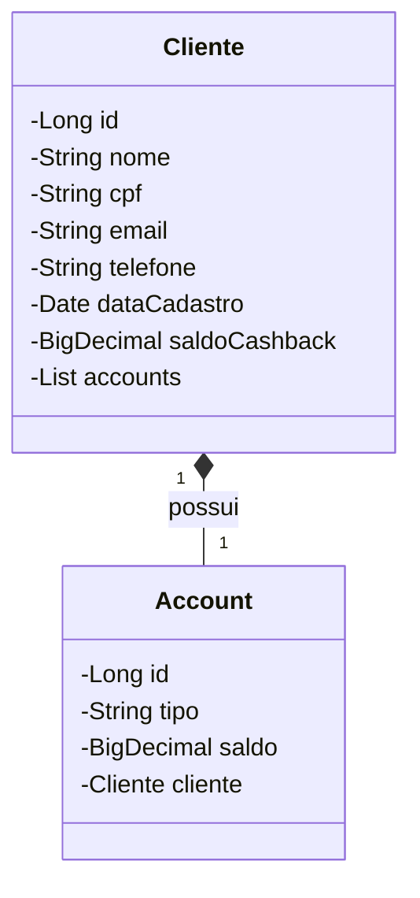

# cliente-farmacia
Último desafio da DIO - Santander Coders 2024

# API de Farmácia

Bem-vindo ao projeto da API de Farmácia. Este projeto utiliza Spring Boot para criar uma API para gerenciar clientes e realizar operações relacionadas a cashback.

## Descrição do Projeto

Esta API foi desenvolvida usando Spring Boot e oferece funcionalidades para gerenciar clientes cadastrados em uma farmácia. Os principais recursos incluem a gestão de clientes e a implementação de cashback.

## Tecnologias Utilizadas

- **Spring Boot 3.1.2**
- **Java 17**
- **Spring Data JPA**
- **PostgreSQL** (armazenamento em nuvem)
- **H2** (armazenamento local para desenvolvimento)
- **Swagger** para documentação da API
- **Gradle** para gerenciamento de dependências
## Diagrama de classes

